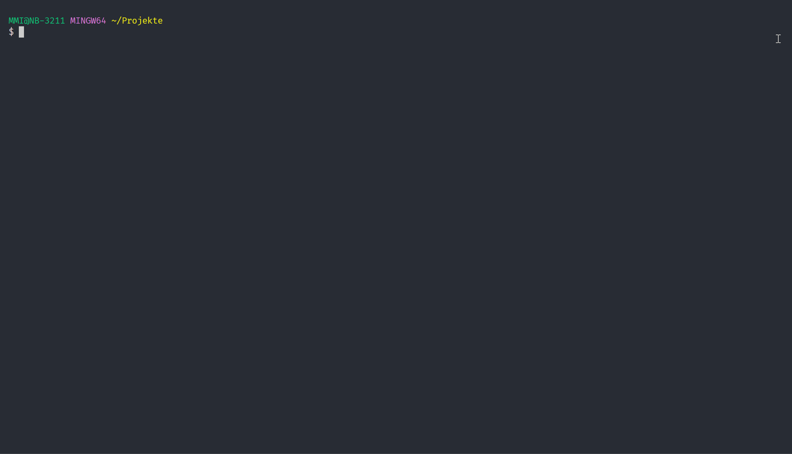

<div align='center'>
  
  <h1>dbFLow</h1>

  > Deployment framework for Oracle Database Applications

  <a href='https://github.com/maikmichel/dbflow/releases'></a>
  <a href='https://github.com/maikmichel/dbflow/blob/main/LICENSE'></a>
</div>

---

<div align='center'>

### Quick Links

<a href='https://maikmichel.github.io/dbFlow/'></a> <a href='https://maikmichel.github.io/dbFlow/getting_started/'></a> <a href='https://maikmichel.github.io/dbFlow/changelog/'></a>

</div>

---
<br/>

**dbFlow** is a deployment tool / framework for database driven applications in the oracle environment, mainly in the area of APEX. With **dbFlow** you can create and deploy multi-layered applications. **dbFLow** is powered by Git and can build a deployment / patch from different commit states, which can then be rolled out to different target instances.

## Features

- create an Oracle Database / APEX Project per command line
- install dependent features (Logger, utPLSQL, ...)
- use a fully customizable deployment flow based on Git diffs
- configure your project dependencies
- generate and process changelogs
- create and test nightlybuilds
- build artifacts based on Git diffs
- deploy patches to target instances


### Generate project

  

### Install project dependencies

  

</br>
</br>

> ## Works best with dbFLux [dbFlux](https://marketplace.visualstudio.com/items?itemName=MaikMichel.dbflow)
>### With that in place you get the ability to
>- compile SQL or PLSQL based on folder structure
>- execute tests based on folder structure
>- minify and upload JavaScript to your APEX Application
>- minify and upload CSS to your Application
>- Export APEX Applications
>- Export REST Modules
>- Create and Upload binary files for reporting (AOP)

</br>
</br>

## Quick Preferred way of installation

1. create a git repositoy
2. add dbFlow as `.dbFlow` submodule to your project
3. run `.dbFlow/setup.sh generate <project_name>`
4. answer some question based on your requirements
5. after that just run `.dbFlow/setup.sh install`

```bash
# create a folder for your project and change directory into
$ mkdir demo && cd demo

# init your project with git
$ git init

# clone dbFlow as submodule
$ git submodule add https://github.com/MaikMichel/dbFlow.git .dbFlow

# generate and switch to your development branch
$ git checkout -b develop

# generate project structure
$ .dbFlow/setup.sh generate <project_name>

# after processing the wizard steps, just install
$ .dbFlow/setup.sh install
```


## Documentation
  [Just read the docs](https://maikmichel.github.io/dbFlow/)

## Frequently Asked Question

> Git creates wrong filenames and dbFlow can't copy / rsync them in a right manner

- This is a git problem and you can turn it of by using following option:
```bash
$ git config --global core.quotepath off
```
