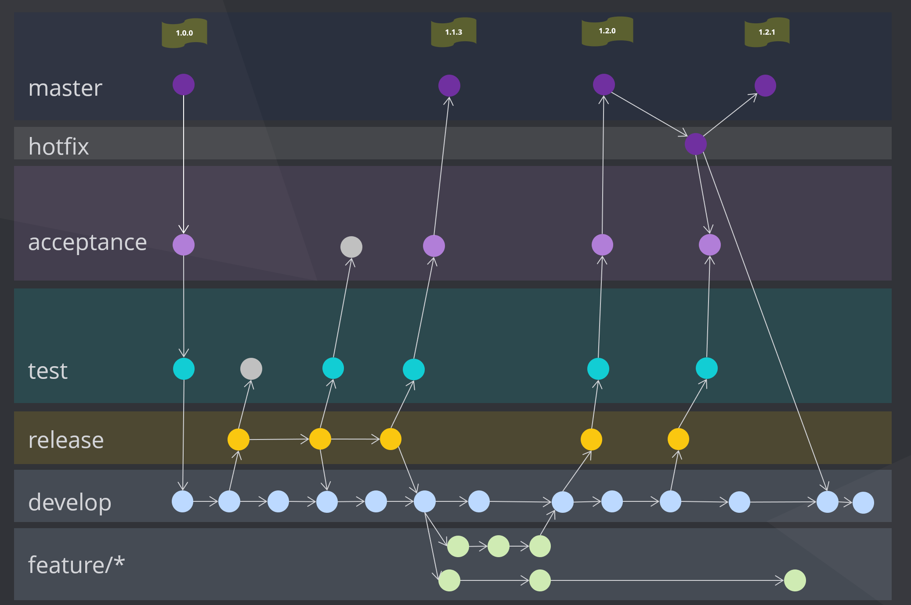
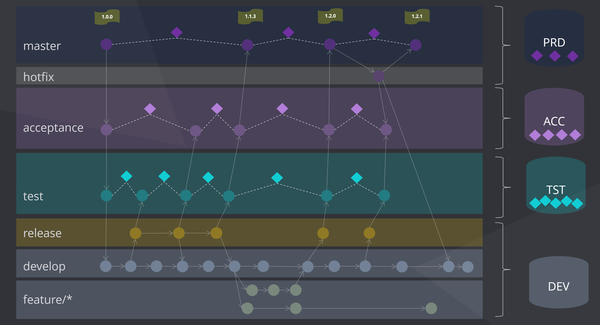
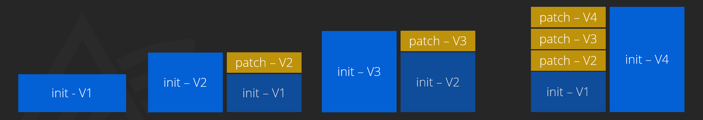
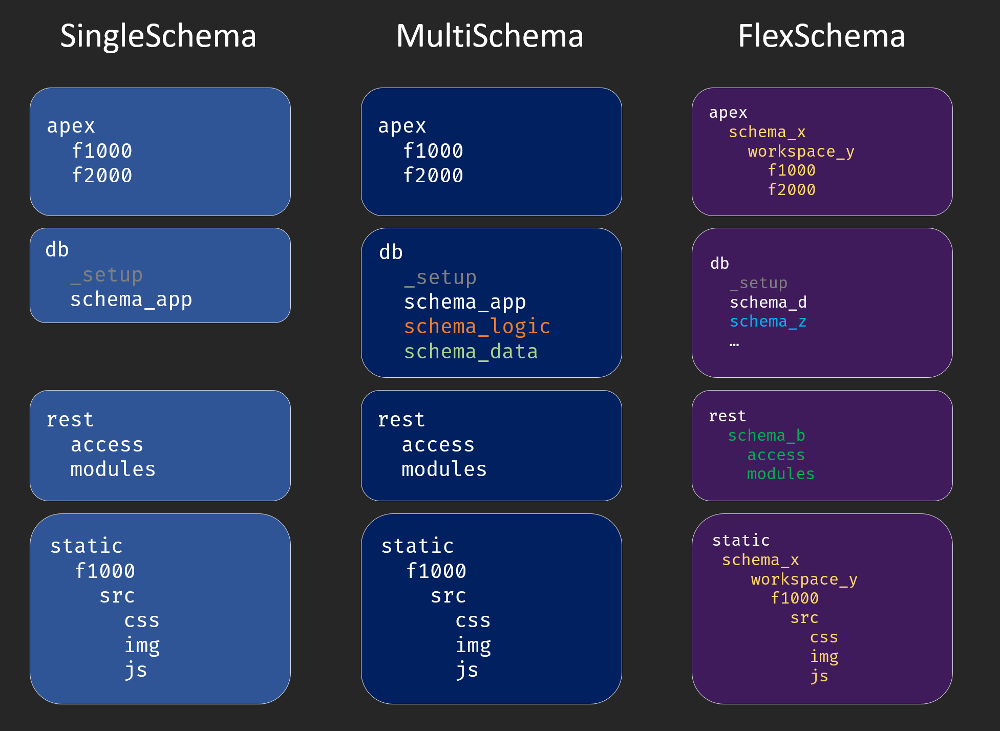
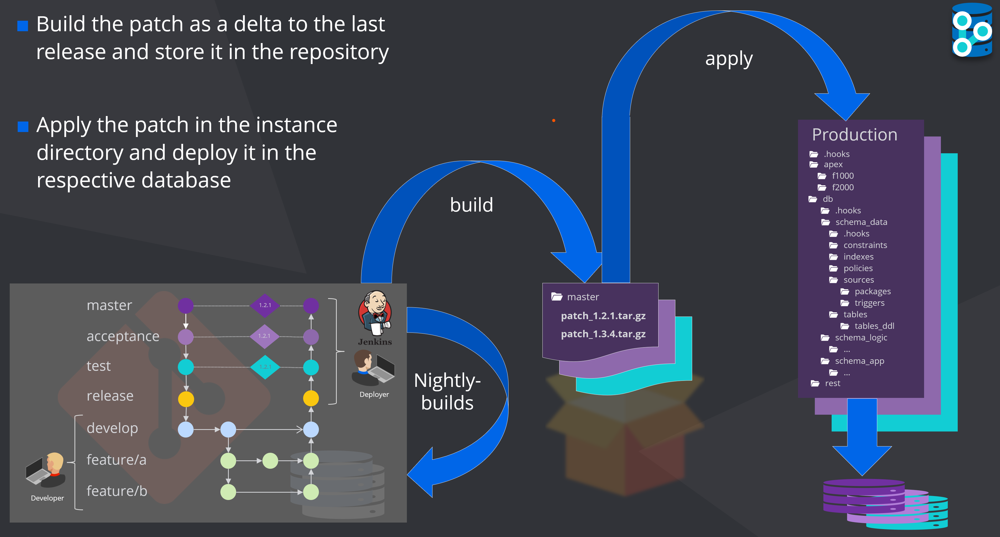

# The Concept

**dbFlow** is based on 4 core topics. These topics are encountered again and again during the work with **dbFLow**. One is the adaptation of the git flow related to the work with database changes, the 2 phase deployment, smartFS, which reflects the directory structure and last but not least the depot, a kind of artifactory.

## Git Flow to DB

**dbFlow** is a deployment framework to deploy Oracle based projects / applications. **dbFlow** is roughly based on the so called Git Flow. This flow describes how releases of an application are delivered from the main development branch to the master branch, production. The following figure outlines this flow.

### Git Flow in short




Development mainly takes place on the develop branch. Features that are not included in the next release are developed in so-called feature branches. If a release has to be built from the current development state, the develop branch is merged into the release branch. This represents at the same time a so-called distribution boundary. This means that development can continue on the development branch and does not have to wait for the actual release. The release is first merged into the next higher branch. In our case this is the test branch. If an error is found here, it is fixed in the release branch and merged back to test. These changes also flow back into the development branch later. If the tests on the test stage are successful, the next branch is merged and the release is tested accordingly. This continues until the respective release has reached the master branch and therefore has reached production.

### Reflect DB changes

**dbFlow** supports the developers and release managers by building an artifact corresponding to the delta of 2 commits. Meaning the changed files, which can be applied to the respective database instance. So whenever you build a patch, you can refer to two commits as start and endpoint of a patch. Those commits can consist of state before and after merging ( HEAD, ORIG_HEAD), commit hashes or tags.



For each target branch a separate database or database container is expected. The artifacts that **dbFLow** generates can then be installed into the databases/containers.


## 2 Phase deployment

**dbFlow** can generate two types of artifacts, which can be applied to the databases. On the one hand this is a so-called **==INIT==**ial deployment, which clears the target schemas first, or expects empty schemas, and on the other hand a **==PATCH==** deployment, which requires the corresponding previous version of a deployment on the database.


!!! info

    Usually, the **==init==**ial deployment is only installed **ONCE** on a production system. After that, only **==patch==** versions are applied.

The advantage of this two-phase approach is that a version of an application can always be built directly and thus forms the basis of a subsequent patch. For example, one can build the **==init==**ial version of a predecessor and install the current state as a **==patch==** on top of it. This procedure forms the basis of flawless releases.




With this approach it is easy to map the concept of NighlyBuilds with Jenkins or similar CI/CD tools. To test whether a release can be applied to Prod/Master, it is sufficient to create an initial release of Master and apply it to a test database. Afterwards, the patch, in other words the delta to the development branch, is applied.

!!! warning "Important"

    - In **==INIT==** mode, all files from all directories except those named with *patch* are applied.
    - In **==PATCH==** mode only the changed files are applied.

    > Files inside ***.hook*** - folders will be always executed

## SmartFS

> SmartFolderStructure

To support this concept, a **dbFlow** project must have a certain directory structure. **dbFLow** expects the following directories at the root level of the project itself.

| Folder          | Description
| --------------- | ---------------------------------------------------
| **apex**        | All APEX application will be stored in this folder
| **db**          | This folder contains the required database schemas and their objects.
| **rest**        | Here the REST services / modules are stored
| **reports**     | binary files for templating purpose
| **static**      | In this folder the files are stored, which you upload later <br/>with the upload command to the static files of the respective application. (managed by *`dbFlux`*)


### Project Types

This structure is independent from the project-type. **dbFlow** knows 3 types of projects: SingleSchema, MultiSchema and FlexSchema




*`SingleSchema`* and *`MultiSchema`* are very similar. APEX applications and REST modules are imported or exported with the application user. The name of the workspace is stored in both modes in the project configuration. In *`MultiSchema`* mode two additional schemas (LOGIC and DATA) are used. Here a three layer model is built up, which holds the data in the DATA schema, the business logic in the LOGIC schema and everything that is application specific in the APP schema. In *`SingleSchema`* mode, a direct database connection is established with the respective schema. In *`MultiSchema`* mode, as well as in *`FlexSchema`* mode, a ProxyUser is used for the database connection, which then connects to the target schema.
If the project is configured in *`FlexMode`*, you can freely configure the corresponding schemas and workspaces via the directory structure. When using *`FlexMode`*, APEX applications are stored within workspace folders, which are again located within schema folders. The same applies to the static subdirectories, of course. REST modules are also stored in their own schema folder in *`FlexMode`*. Importing or exporting is done via the proxy user, which connects to the respective schema, which is configured by directory name.


### Schema Folders

Each schemafolder inside **db** folder except `_setup` is build with the same structur.

| <div style="width:150px">Folder</div>| Description
|-------------------|---------------------------------------
| db                |
| *_setup*       | This folder contains the required objects your application depends on. <br/>All scripts inside are called by the preferred admin account you configured (sys, admin, ...)
| .. schema         |
| .... constraints  | Constraints are stored here and subdivided according to their type
| ...... checks     | Check Constraints
| ...... foreigns   | Foreign Keys
| ...... primaries  | Primary Keys
| ...... uniques    | Unique Keys
| .... contexts     | Sys_Contexts when needed
| .... ddl          | DDL Scripts for deployment subddivided on deployment mode
| ...... init       | Init scripts are executed only for the first installation (init).
| ...... patch      | Patch scripts are executed only in the update case (patch) <br/>and are divided into scripts that are executed at the beginning <br/>or at the end of the respective update.
| ........ post     |
| ........ pre      |
| .... dml          | DML Scripts for deployment subddivided on deployment mode
| ...... base       | Base scripts are always executed, no matter in what mode the deployment is used (first install - init) <br/>or (update - patch). Therefore they must be restartable.
| ...... init       | Init scripts are executed only for the first installation (init).
| ...... patch      | Patch scripts are executed only in the update case (patch) and are<br/> divided into scripts that are executed at the beginning <br/>or at the end of the respective update.
| ........ post     |
| ........ pre      |
| .... indexes      | Indexes are stored here and subdivided according to their type
| ...... defaults   | Non uniqe indexes
| ...... primaries  | Unique Indexes based in primary key columns
| ...... uniques    | Unique Indexes
| .... jobs         | Jobs, Scheduler scripts goes here
| .... policies     | Policies
| .... sequences    | Sequences must be scripted in a restartable manner
| .... sources      | All PL/SQL Code is stored in respective subfolders
| ...... functions  |
| ...... packages   | Extension for package specification is pks and extension pkb <br/>is used for body
| ...... procedures |
| ...... triggers   |
| ...... types      |
| .... views        | Views goes here
| .... tables       | Here are all create table scripts stored
| ...... tables_ddl | All table alter or modification scripts named <br/>with tablename.num.sql goes here
| .....tests        | Unittests
| ...... packages   | Packages containing utPLSQL Unittests


All files must be stored as executable SQL scripts. dbFlow uses SQLPlus or SQLcl to import these scripts.

!!! Warning

    Don't forget the trailing slashes in PLSQL files

### Installation Sequence

The file structure has several purposes. On the one hand, these directories represent a fixed point in time during deployment, i.e. they reflect the order of execution. For example, tables are applied before the indexes and the constraints. Primary key constraints are applied before foreign key constraints, and so on.


In addition, the division of the table directory into tables and tables_ddl represents a kind of toggle. In case of an **==init==**ial delivery only the scripts from the table directory are executed. If it is a **==patch==** delivery, the script from the table directory will not be executed if files with the same root name exist in the tables_ddl directory.

For example, if the table employees changes, the file is updated accordingly with the actual create-table statement. In addition, a matching alter-table script with the same base name is stored in the tables_ddl directory.


```sql
// employees.sql
create table employees (
  emp_id        number not null,
  emp_name      varchar2(250 char) not null,
  emp_birthday  date                        -- new column
);
```
```sql
// employees.1.sql
alter table employees add (
  emp_birthday  date                        -- new column
);
```


| files                 | content                |
| --------------------- | ---------------------- |
| tables                |                        |
| - table_ddl           |                        |
| - - employees.1.sql   | alter table add (..);  |
| - employees.sql       | create table (..);     |


!!! tip

    - Changes to tables are always made 2 times. Once for a new installation (**==init==**) and once for an update (**==patch==**).
    - Table scripts may only contain the pure tables and comments. Constraints and indexes must be stored in the appropriate directories.
    - Files from the table directory are executed if it is a new installation (**==init==**) or if the table is to be newly created in this update (**==patch==**).
    - Within the directories the files to be imported are sorted alphabetically, except for the package directory.


#### init
> The following schema directories are applied in exactly this order during an **==init==** deployment:

- .hooks/pre
- sequences
- tables
- indexes/primaries
- indexes/uniques
- indexes/defaults
- constraints/primaries
- constraints/foreigns
- constraints/checks
- constraints/uniques
- contexts
- policies
- sources/types
- sources/packages
- sources/functions
- sources/procedures
- views
- mviews
- sources/triggers
- jobs
- tests/packages
- ddl
- ddl/init
- dml
- dml/init
- dml/base
- .hooks/post

#### patch
> The following schema directories are applied in exactly this order during a **==patch==** deployment:

- .hooks/pre
- ddl/patch/pre_${*branch-name*}
- dml/patch/pre_${*branch-name*}
- ddl/patch/pre
- dml/patch/pre
- sequences
- tables
- tables/tables_ddl
- indexes/primaries
- indexes/uniques
- indexes/defaults
- constraints/primaries
- constraints/foreigns
- constraints/checks
- constraints/uniques
- contexts
- policies
- sources/types
- sources/packages
- sources/functions
- sources/procedures
- views
- mviews
- sources/triggers
- jobs
- tests/packages
- ddl
- ddl/patch/post_${*branch-name*}
- dml/patch/post_${*branch-name*}
- ddl/patch/post
- dml
- dml/base
- dml/patch/post
- .hooks/post

### Hooks

On each level of the main directories there are so called `.hooks` folders. You can find them in the root directory, in the db folder and in the schema folders. The `.hooks` folders are always divided into the subfolders `pre` and `post`. During the deployment process the scripts there will be executed in alphabetically order. These type of folders are meant to hold scripts which won't change too much during lifecycle of your product. For example you could place some kind of generator script inside here (Gen TableAPI, ...).

!!! Note

    Hookscripts outside the respective schema folders **must** contain the corresponding target schema in the name.

```
├─ .hooks
│  ├─ pre
│  │  ├─ init
│  │  ├─ patch
│  │  │  └─ 01_schema_a_do_something_in_patch_mode.sql
│  │  ├─ 01_schema_a_do_something.sql
│  │  └─ 02_schema_a_do_something.sql
│  └─ post
│     ├─ 01_schema_c_do_something.sql
│     ├─ 02_schema_b_do_something.sql
│     └─ 03_schema_b_do_something.sql
├─ apex
├─ db
│  ├─ .hooks
│  │  ├─ pre
│  │  │  ├─ init
│  │  │  └─ patch
│  │  └─ post
│  │     ├─ init
│  │     └─ patch
│  ├─ schema_a
│  └─ schema_b
│     ├─ .hooks
│     │  ├─ pre
│     │  │  └─ init
│     │  │  └─ patch
│     │  ├─ post
│     │  │  └─ init
│     │  │  └─ patch
│     └─ ...
├─ rest
├─ static

```


To execute a hook on a specific object type, you can add this structure to the corresponding directory within the schema hook. In this case you won't have the ability to diffentiate between the to modes.

```
├─ db
│  └─ schema_a
│     ├─ .hooks
│     │  ├─ pre
│     │  └─ post
│     │     └─ sources
│     │        └─ packages
│     │           └─ call_me_after_packages_applied.sql
│     └─ sources
│        └─ packages
│           ├─ my_package.pks
│           └─ my_package.pkb
```

### APEX Applications

Applications are stored in the apex directory. The applications will be expected in splitted form. For each application there is a corresponding folder containing the respective files (standard APEX export). For a deployment only the appropriate changes are included. A configuration option can be used here, in order to include all files into the deployment.

```
├─ apex
│  └─ f1000
│  │  ├─ application
│  │  └─ install.sql
│  └─ f2000
```

In SingleSchema and MultiSchema mode, the workspace is stored in the project configuration. The target schema is always the APP schema. If you use FlexSchema mode, however, this information is stored in the directory tree itself.

```
├─ apex
│  └─ schema_a
│  │  └─ workspace_x
│  │     └─ f1000
│  └─ schema_b
│     └─ workspace_y
│        └─ f2000

```

### REST Modules

If you use REST modules in your project, they are placed in the rest folder. Here dbFlow also expects a certain directory structure. This has a direct influence on the order of execution during the deployment.

```
├─ rest
│  ├─ access
│  │  ├─ roles
│  │  ├─ privileges
│  │  └─ mapping
│  └─ module
│     ├─ module_name_a
│     │  └─ module_name_a.module.sql
│     └─ module_name_b
│        ├─ module_name_b.module.sql
│        └─ module_name_b.condition.sql
```

Files are imported into these folders in the following order.

1. access/roles
2. access/privileges
3. access/mapping
4. modules

Within the folders the order is alphabetical. If dbFLow finds a module file with the same file base and the extension *.condition.sql, this condition will be included in the install script.

!!! Warning "Important"

    In the Condtion file a PLSQL expression is expected which returns a boolean value. Later this expression becomes part of an IF condition. In order to work that way the module file itself has to **exclude** then trailing slash on the last line!


## Depot

When you create a deployment, whether **==INIT==** or **==PATCH==**, the deployment artifact is stored in a so-called depot. From this depot, a CI/CD tool, for example, can later fetch the artifact and install it on the target instance. Within the depot directory, the individual deployments are stored in subdirectories that correspond to the Git branch from which they were created. After a successful installation, the patch, including all logs and temporary files, is placed in the success folder. Errors during the deployment lead to an abort and are stored in the failures subfolder.


I recommend to use a separate repository or directory for each stage DB. This has the advantage that the corresponding directories serve their purpose even without Git and possibly access to the development repository. Theoretically, the repository can also be "doubled" to have a target directory at home and a source directory at the customer.

# Big Picture



