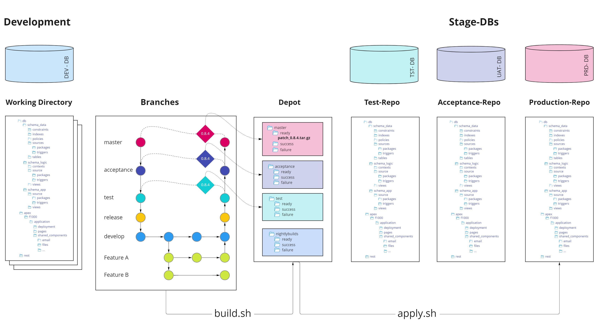

# Deployment

As already described in the [concept] dbFlow knows two types of releases. One is the initial release, which imports the complete product against empty schemas or clears them first, and the other is the patch release, which determines the delta of two commit levels and applies it on top to an existing installation.

   [concept]: ../concept/#2-phase-deployment




A deployment can be divided into two steps. In the first step, the artifact is built. This is done by the script `.dbFlow/build.sh`. In the second step the artifact is applied to the target environment. This is done by calling the script `.dbFlow/apply.sh.`

- Step 1: **build** - This is where the artifact is created.
- Step 2: **apply** - This is where the artifact is deployed to the respective target environment.

!!! danger "Warning"

    Remember, during an init, the target schemas are cleared at the beginning. All objects will be dropped!


## build

The build.sh script is used to create the so-called build file or artifact. This is used to create the actual release based on the state of the files in the directory tree / Git repo.
As with any dbFlow script, you can display the possible parameters by omitting the parameters or explicitly with the ``--help`` parameter.

The build.sh script creates a tar ball with all relevant files and stores it in the depot. The location of the depot is determined in the file apply.env.


### init

Example: `.dbFlow/build.sh --init --version 1.0.0`

In an **init**ial release, all files from the database directories are determined and imported in a specific order.

By using the flag ``-i/--init`` an **init**ial release is created. Additionally you need the target version of the release. With the flag ``-v/--version`` you name the version of the release.
The files from the directories ``\*/[ddl|dml]/patch/\*`` and ``\*/tables/tables_ddl`` are ignored.
The release itself is created from the current branch. If you want to create a release from another branch, you have to switch there with Git first.


!!! info "Order of the directories"

    | Num    | Folder                 | Num | Folder              | Num | Folder         |
    |--------|------------------------|-----|---------------------|-----|----------------|
    |   1    | .hooks/pre             |  11 | contexts            | 21  | tests/packages |
    |   2    | sequences              |  12 | policies            | 22  | ddl/init       |
    |   3    | tables                 |  13 | sources/types       | 23  | dml/init       |
    |   4    | indexes/primaries      |  14 | sources/packages    | 24  | dml/base       |
    |   5    | indexes/uniques        |  15 | sources/functions   | 25  | .hooks/post    |
    |   6    | indexes/defaults       |  16 | sources/procedures  |     |                |
    |   7    | constraints/primaries  |  17 | views               |     |                |
    |   8    | constraints/foreigns   |  18 | mviews              |     |                |
    |   9    | constraints/checks     |  19 | sources/triggers    |     |                |
    |  10    | constraints/uniques    |  20 | jobs                |     |                |


> If you use the flag -a/--apply then the release will be directly applied to the current environment.


#### Additional arguments in init mode:

- ***keepFolder***

With the flag ``-k / --keepfolder`` the working directory, which is created in the depot to create the actual artifact, is not deleted. Especially in the beginning, when you don't have so much experience with dbFlow, this option is helpful. So after creating the artifact you can navigate to the corresponding directory and have a look at the created scripts and copied files.


### patch

Example: `.dbFlow/build.sh --patch --version 1.1.0`

By using the flag ``-p/--patch`` a patch release is created. Additionally you need the target version of the release. With the flag ``-v/--version`` you name the version of the release.

In a **patch** release all changed files are determined. These files then become part of the deployment. Which files are considered as modified is determined by Git. With the parameters ``-s/--start`` (defaults to ORIG_HEAD) and ``-e/--end`` (defaults to HEAD) one can set these parameters explicitly. Which files become part of the **patch** can be output by using the ``-l/--listfiles`` flag.

> Start should always be at least one commit prior to the end commit.

The files from the directories ``\*/[ddl|dml]/init/\*`` are ignored. Additionally there is the import switch, which says, that if the table to be changed exists in the ``table`` folder **AND** in the ``table_ddl`` folder, **ONLY** the files with the same name from the ``table_ddl`` folder are imported.


!!! info "Order of the directories"

    | Num  | Folder                    | Num  | Folder                    | Num  | Folder                    |
    |------|---------------------------|------|---------------------------|------|---------------------------|
    |  01  |  .hooks/pre               |  12  |  constraints/primaries    |  23  |  mviews                   |
    |  02  |  ddl/patch/pre_${branch}  |  13  |  constraints/foreigns     |  24  |  sources/triggers         |
    |  03  |  dml/patch/pre_${branch}  |  14  |  constraints/checks       |  25  |  jobs                     |
    |  04  |  ddl/patch/pre            |  15  |  constraints/uniques      |  26  |  tests/packages           |
    |  05  |  dml/patch/pre            |  16  |  contexts                 |  27  |  ddl/patch/post_${branch} |
    |  06  |  sequences                |  17  |  policies                 |  28  |  dml/patch/post_${branch} |
    |  07  |  tables                   |  18  |  sources/types            |  29  |  ddl/patch/post           |
    |  08  |  tables/tables_ddl        |  19  |  sources/packages         |  30  |  dml/base                 |
    |  09  |  indexes/primaries        |  20  |  sources/functions        |  31  |  dml/patch/post           |
    |  00  |  indexes/uniques          |  21  |  sources/procedures       |  32  |  .hooks/post              |
    |  11  |  indexes/defaults         |  22  |  views                    |      |                           |


```shell
$ .dbFlow/build.sh --patch --version 1.1.0
$ .dbFlow/build.sh --patch --version 1.2.0 --start 1.0.0
$ .dbFlow/build.sh --patch --version 1.3.0 --start 71563f65 --end ba12010a
$ .dbFlow/build.sh --patch --version 1.4.0 --start ORIG_HEAD --end HEAD
```

For example, by using stage branches, you can merge the current state of the develop branch into the test branch and build the release by implicitly using the Git variables HEAD and ORIG_HEAD.

```shell
# make shure you have all changes
@develop$ git pull

# goto branch mapped to test-Stage
@develop$ git checkout test

# again: make shure you have all changes
@test$ git pull

# merge all chages from develop
@test$ git merge develop

# build the relase artifact
@test$ .dbFlow/build.sh --patch --version 1.2.0
```

#### Repair

If you want to put something only in a certain stage, for example because something went wrong in a release, so you want to clean it up, you can put these scripts in the directories `ddl/patch/pre_${branch}` or `dml/patch/pre_${branch}`. Since the concept is that branches are assigned to stages, these scripts will only be executed in those stages.


#### Additional arguments in patch mode:

- ***keepFolder***

With the flag ``-k / --keepfolder`` the working directory, which is created in the depot to create the actual artifact, is not deleted. Especially in the beginning, when you don't have so much experience with dbFlow, this option is helpful. So after creating the artifact you can navigate to the corresponding directory and have a look at the created scripts and copied files.

- ***transferAll***

In order to always transsper/copy all files, you can specify the ``-t / --transferall`` flag. In this case not only the changed files but all files will be included in the patch. During the deployment only the changed files will be applied within the DB directory.

- ***listFiles***

The -l / --listfiles flag can be used to check which files would be included in the artifact. With this option no actual build takes place.

- ***apply***

The -a / --apply flag can be used to apply the created artifact immediatly in to the current environment after building the patch.


## apply

The apply.sh command applies a release to the respective configured database. The artifact is fetched from the depot and unpacked into the appropriate directory. Afterwards the installation scripts are executed. The environment variable STAGE, from the file apply.env, is used to determine the source directory of a release. The build script stores the artifacts in a directory in a depot that contains the current branch name. The naming of the variable STAGE is now used to get the artifact matching the stage / database connection.


> With this method there can be n instances, which all point to the same depot directory.

!!! info

    I recommend to create a corresponding instance directory for each database and to version it as well. This directory should also contain a .dbFlow - submodule. It is sufficient to copy the files apply.env and build.env into the directory and to adjust the database connection and the stage.
    See: [../concept/#big-picture](../concept/#big-picture)


### init

!!! danger "Warning"

    Importing an init release leads to data loss!


By specifying the ``-i/--init`` flag, an init release is retrieved from the depot and then applied. If no password is stored in the apply.env (this is recommended), it will be requested at the very beginning. Because on init then content of all included schemas will be deleted you are asked to proceed. When you provide an environment variable called ``DBFLOW_JENKINS`` with any value the question is skipped.


```shell
$ .dbFlow/apply.sh --init --version 1.0.0
```

!!! info "CI/CD"

    All environment variables that are used in **dbFlow** by sourcing the files build.env and apply.env can also be provided from the outside, i.e. without the file system. Especially if you use tools like Jenkins and Co, you can influence the configuration of the targetstage.


#### Additional arguments in init mode:

- ***noExtract***

When using ``-n/--noextract`` flag, dbFlow will not not move and extract then artifact from depot. This option can be used to extract files manually or use a allready extracted artifact.


### patch

By specifying the ``-p/--patch`` flag, a patch release is imported from the depot and then applied. If no password is stored in the apply.env (this is recommended), it will be requested at the very beginning.

```shell
$ .dbFlow/apply.sh --patch --version 1.1.0
```

After the installation of a release, all resulting log and installation files are stored in the configured `LOG_PATH` under a version directory and *success* or *failure*. Failure of course only if the installation was aborted due to an error.

#### Additional arguments in patch mode:

- ***noExtract***

When using ``-n/--noextract`` flag, dbFlow will not not move and extract then artifact from depot. This option can be used to extract files manually or use a allready extracted artifact.

- ***redoLog***

Now it can happen that you want to continue the installation after an interruption at the same place. For this the parameter ``-r/--redolog`` is used. If you specify the log file of the previous installation, it will be analyzed and continued with the step that leads to an abort.

```shell
$ # get and copy the failed patch to instance folder
$ cp ../depot/test/failure/patch_1.1.0.tar.gz ./
$
$ # apply patch by installing only the uncalled db scripts
$ .dbFlow/apply.sh --patch --version 1.1.0 --redolog ./_log_path/test/failure/20230613121314_dpl_patch_1.1.0.log
```


### Interactive Execution

By using the option `-s/--stepwise` you are able to run the execution stepwise. Before each section of execution you will be asked to proceed.


!!! note "Note"

    Keep in mind that you have to implement the fixes by your own. dbFlow won't reverse anything. When you want to clean you accidental applied files, you have to ship a cleanup script and put it in your stage folders: `ddl/patch/pre_${branch}` or `dml/patch/pre_${branch}`

## release

Most of the time we do a patch release. So in these cases you have to:

1. Change to the target branch
2. Merge the source branch into it
3. Build the patch
4. If necessary tag the version in Git *(optional to be implemented)*
5. Apply the version in the target environment *(optional)*

You don't have to do these steps manually if you use the ``.dbFlow/release.sh`` script. Here you can simply specify your target branch and the script does the appropriate steps to merge the respective branches itself.
By omitting the parameters you can also see what is needed.

> release.sh does the handling / merging of the branches for you and calls build.sh afterwards.

```shell
  .dbFlow/release.sh --target master --version 1.2.3
```

To do a release test, the release script can build three artifacts for you (flag ``-b/--build``). This functionality is for the so-called nightly builds. Here an initial release of the predecessor, a patch of the successor, and an initial release of the successor are built. Using a CI/CD server, such as Jenkins, you can then create these 3 artifacts and install them one after the other on the corresponding instance and of course test them.

```shell
.dbFlow/release.sh --source develop --target master -b
```

#### Additional arguments for release:

- ***build***

As described above, the ``-b/--build`` flag creates 3 artifacts. These represent the current initial release, the previous initial release and the current patch release. All 3 artifacts can then be imported into the target environment in the appropriate order.

- ***apply***

With the option ``-a/--apply`` and the following argument of the instance directory, the release or releases (nightly builds) will be applied directly to the target instance.

```shell
$ .dbFlow/release.sh --source develop --target master --build --apply ../instances/nightly
```

- ***keep***

The ``-k/--keep`` option prevents the working folders in the depot directory from being deleted.
