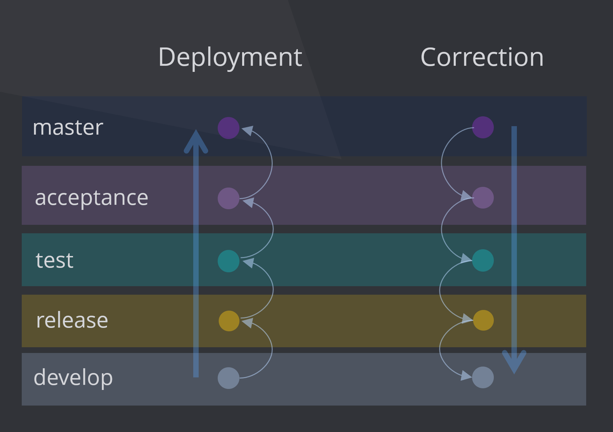

# Frequently Asked Questions or Tips

## How can I correct an existing error retrospectively?

Sometimes it happens that an error slips in. This can happen, for example, if you forget to test the current version of the initial deployment (``init``). As soon as this happens and an error appears here, the subsequent deployments cannot build their predecessor cleanly.
If something like this happens, then you have to merge the error correction from *"top to bottom"*, i.e. from the production branch (**master** or **main**) down to the develop branch. This ensures that at the next deployment, the predecessor (e.g. version on **test**) can be built cleanly.

  { width="400"}

## ProxyUser - connection problems

Sometimes it can happen that **dbFlow** or *SQLplus* or *SQLcl* cannot connect to the database. The error: ``ORA-01017: invalid username/password; logon denied`` is displayed. This may be due to the fact that in a SingleSchema the database directory does not match the value of the variable `DB_APP_USER` from the file `apply.env`. Please also check the notation here. **dbFlow** will _ALWAYS_, if the directory != DB_APP_USER, perform the login as proxy user to the database (`proxy_user[schema_name]@database:port`).

