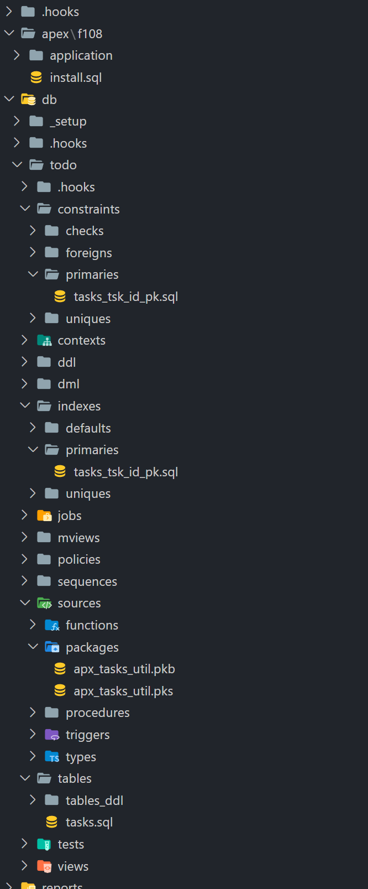
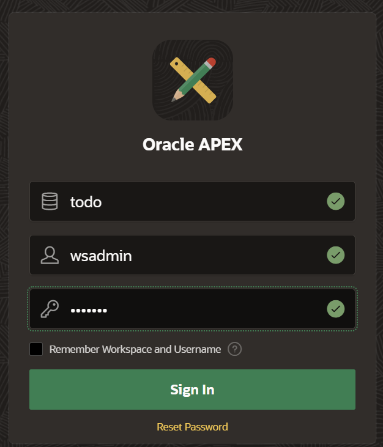
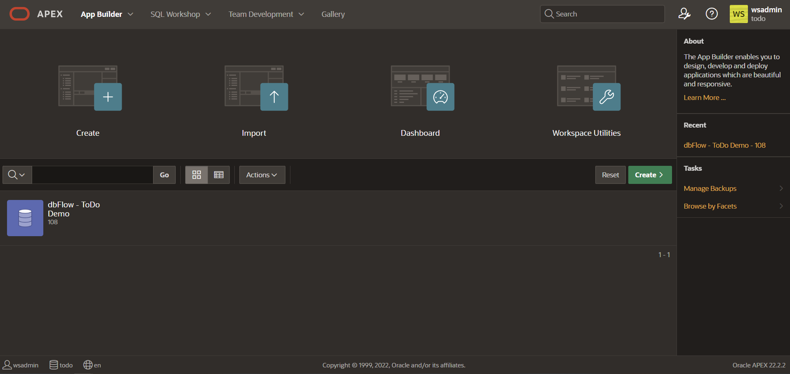
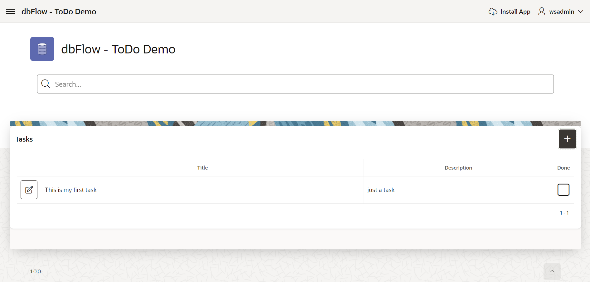
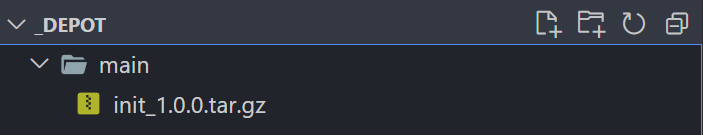
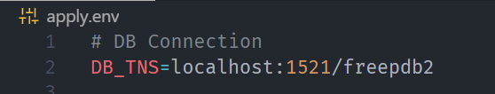
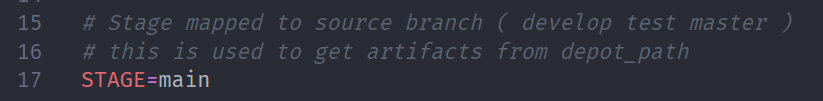
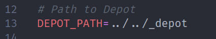
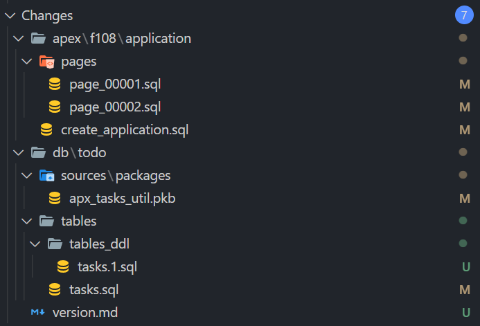

A Tutorial

## Intro

In this tutorial we will build a ToDo application. This application will be developed in our development database and will be updated from time to time in our production database. The production database reflects here only a part of our release pipeline. In a real environment we might need more target stages. For our tutorial this should be sufficient.

To build the whole system locally, I use dockawex. Here, a complete development environment including a second build environment (this is our prod) is built via docker-compose. Absolutely recommended. See: [dockawex](https://github.com/MaikMichel/dockawex)


## Prerequisites

- Two database connections and the ability to connect as sys or another authorized user to create schemas and users.
- Every database with a proper installation of Oracle APEX

> just use dockawex and build and start your containers


## 01. Configuration

First we create a new project directory `todos`. In this directory we create the `_depot` folder, where the artifacts of the deployments will be stored and fetched later. In an `instance` directory we create a subfolder for each target environment. In our case this is the `prod` folder, which is the productive environment for this tutorial. Furthermore we create the actual working directory called `sources`. This is the actual development folder. and will be versioned via Git.

```bash
# create master directory
$: mkdir todos && cd todos

# create folder to hold depot, target-instance and sources
todos$: mkdir _depot && mkdir -p instances/prod && mkdir sources

# just to show current content
todos$: find

# should produce
# .
# ./_depot
# ./instances
# ./instances/prod
# ./sources

```

Now we change to our actual source directory, turn on version control and install **dbFlow**.

```bash
# go to sources
todos$: cd sources

# add git
sources$: curl -sS https://raw.githubusercontent.com/MaikMichel/dbFlow/master/install.sh | bash

```

Now that we have submitted the directory, we can save the current empty state and switch to a new develop branch where we will work.

```sh
# add current changes
sources[master]$: git add .

# do the commit
sources[master]$: git commit -m "Inital commit, with dbFlow added as submodule"

# create new branch and jump right in
sources[master]$: git checkout -b develop

```

## 02. Setup dbFlow

Now that we have the directory and git set up, we can configure **dbFlow**. For our application and just for demo purposes a SingleSchema is completely sufficient. Additionally we place the depot a level up and negate the installation of the default features. I leave all other settings in the default.

```bash
sources[develop]$: .dbFlow/setup.sh --generate todo
```

!!! note "output of project wizard"

    ```cmd
    Generate Project: todo
    Which dbFLow project type do you want to create? Single, Multi or Flex [M]: S
    When running release tests, what is your prefered branch name [build]:
    Would you like to process changelogs during deployment [N]:
    Enter database connections [localhost:1521/xepdb1]:
    Enter username of admin user (admin, sys, ...) [sys]:
    Enter password for sys [leave blank and you will be asked for]: ************
    Enter password for user todo [leave blank and you will be asked for]: ************
    Enter path to depot [_depot]: ../_depot
    Enter stage of this configuration mapped to branch (develop, test, master) [develop]:
    Do you wish to generate and install default tooling? (Logger, utPLSQL, teplsql, tapi) [Y]: N
    Install with sql(cl) or sqlplus? [sqlplus]:
    Enter path to place logfiles and artifacts into after installation? [_log_path]
    Enter application IDs (comma separated) you wish to use initialy (100,101,...):
    Enter restful Moduls (comma separated) you wish to use initialy (api,test,...):

    ```

!!! note "output of dbFlow, when generating the project"

    ```cmd
    Generating project with following options
      Project:                          todo
      Mode:                             S
      Build Branch:                     build
      Create Changelos:                 N
      Schema Changelog proccessed:
      Connection:                       localhost:1521/xepdb1
      Admin User:                       sys
      Deployment User:                  todo
      Location depot:                   ../_depot
      Branch is mapped to Stage:        develop
      SQl commandline:                  sqlplus
      Install default tools:            N
      Configure with default apps:
      Configure with default modules:
      Just install environment onyl:    NO

    ... workinging ...


    Congratulations!
    Your project todo has been successfully created.
    Scripts have been added inside directory: db/_setup that allow you
    to create the respective schemas, workspaces as well as ACLs and features, as long
    as you specified them during the configuration.

    todo - directory structure
    |-- _depot                 >> Path to store your build artifacts
    |-- .dbFlow                >> dbFlow itself
    |-- .hooks                 >> Scripts/Tasks to run pre or post deployment
    |-- apex                   >> APEX applications in subfolders (f123)
    |-- db                     >> All DB Schemas used
    |   |-- _setup             >> Scripts to create schemas, features, workspaces, ...
    |   |-- .hooks             >> Scripts/Tasks to run pre or post db schema deployments
    |   |-- todo               >> Main DB Schema mostly used for SingleMode
    |-- reports                >> Place all your binaries for upload in a seperate folder here
    |-- rest                   >> REST Modules
    |   |-- access             >> Place all your privileges, roles and clients here (plsql)
    |   |-- modules            >> The REST modules inside seperate folders
    |-- static                 >> StaticFiles used to uploads go here (managed by dbFlux)
    apply.env                  >> Environment configuration added to .gitignore
    build.env                  >> Project configuration
    ```

### Review folders

**dbFLow** has now created the complete directory structure for us. Additionally we see the files `build.env` and `apply.env`. In the file `build.env` project specific settings are stored and in the file `apply.env` environment specific settings are stored. Therefore **dbFlow** put the apply.env directly on the `gitignore` list. Later, when it comes to deployment to another environment, this configuration is adapted to the target system accordingly.

**dbFlow** creates a folder `db/_setup`. Here we will find the scripts necessary to create the schema and the workspace for APEX. All files can be edited as required. **dbFlow** will install all existing files in the appropriate order. See: [install project](../setup/#install-project)

## 03. Install project definition (setup) to database

Now that the project structure has been successfully created and we have the import scripts reviewed in the setup folder, we can import the project to the database

```bash
sources[develop]$: .dbFlow/setup.sh --install
```

**dbFlow** will now execute all scripts.

!!! danger "Important"

    Remember, **dbFlow** will delete the target schema on its own and create it again. If the target schema already exists, **dbFlow** will abort the installation. <br/>Only the `--force` option can be used to force this behavior.

When everything is done, the actual work can begin. In our case, of course, we honor this with a corresponding commit.

```bash
sources[develop]$: git add . && git commit -m "dbFlow Project created and applied to dev"
```


## 04. Implement the first version of our todo app


> I won't go to much into the details. All code fragments are meant to show you the working process with **dbFlow** as deployment tool and framework.

### Download and unpack files of version 1

```bash
# Download Release 1
sources[develop]$: curl -o release_1.tar.gz -L https://github.com/MaikMichel/dbFlow-demo-todoapp/archive/refs/tags/1.0.0.tar.gz

# Unpack Application f108 to apex
sources[develop]$: tar -xzvf release_1.tar.gz --directory="apex" "dbFlow-demo-todoapp-1.0.0/apex" --strip-components=2

# Unpack Schema files to db/todo
sources[develop]$: tar -xzvf release_1.tar.gz --directory="db/todo" "dbFlow-demo-todoapp-1.0.0/db/todo" --strip-components=3

# Remove downloaded release_1.tar.gz
rm release_1.tar.gz
```

!!! note

    If you want to install the demo application with another ID then 108 you can rename the folder as you like (f###)


### Install Application

You have downloaded all the files and unpacked them into your prepared **dbFlow** project. That means we can tell **dbFLow** to install all the files. All you have to do is to build an **initial** version and give it the version name "install". **dbFlow** will then directly install the freshly built version into the current environment.

```bash
sources[develop]$: .dbFlow/build.sh --init --version install
```

Then you can familiarize yourself with the application and the files it contains. In the schema you will find the *tasks* table and corresponding constraints, indexes and triggers. Additionally you will find the package *apx_tasks_util*, which contains the business logic of our application.

{ width="300" }


When you go to your APEX instance, you can log in with the default user `wsadmin`. When you log in for the first time, you will have to enter a new password. The initial password is always the username. Unless you have changed it before installing the setup. See file: `db/_setup/workspaces/todo/create_01_user_wsadmin.sql`

{ width="300" }


The application is a simple task management.


Now that we have our first version installed, we commit our current state.

```bash
sources[develop]$: git add .
sources[develop]$: git commit -m "Version 1 of ToDo App"
```

### Deploy Application

Now we have finished version 1 and want to deploy it to the production environment right away. To do this, we are now building our first deployment, our initial patch.
The concept, which **dbFlow** is based on, assumes that there is a corresponding branch per target environment. (See: [Concept](../concept/#git-flow-to-db))

Therefore we now merge our current state in the branch `develop` to the `master` branch, our target branch.

```bash
sources[develop]$: git checkout master
sources[master]$: git merge develop
```

Now we create the initial deployment for our production environment.

```bash
sources[master]$: .dbFlow/build.sh --init --version 1.0.0
```

As soon as the build of an artifact is executed by the master branch, **dbFlow** will ask if a tag with the corresponding version should be committed. In our case we can skip that by entering `N`. **dbFlow** will now place the deployment artifact in the master folder in the depot.


{ width="400px" }

> The target depot is always a sub directory with the same name as the branch from which the artifact is created.

## 05. Prepare Target Instance

> The target instances in this tutorial are all accessible from development. In a real world scenario, they will be located on other hosts.

In the preparations we have already stored our directory structure. Now we want to distribute our current application to the target instance.

### Copy Configuration

In this step we copy the current configuration to the instance directory.

```bash
sources[master]$: .dbFlow/setup.sh --copyto "../instances/prod"
```

**dbFlow** will now copy the `db/_setup` directory and the `build.env` and `apply.env` files to the target directory. Afterwards **dbFlow** will also add itself as a submodule in this directory.
Let's go to the instance directory and modify some configurations.

```bash
sources[master]$: cd ../instances/prod
instances/prod[master]$: code apply.env
```

> I use VisualStudio Code to edit the file `apply.env` but you could any other editor too.

### Edit TNS

Since the copy of the configuration of course still points to the same database environment, it **must** now be adapted. For this we change the corresponding entry in the file `../instances/prod/apply.env`.



> In our case, this is now the xepdb2 instead of xepdb1.


### Edit Stage

Additionally we adjust the entry `STAGE`, because this points to the branch folder in the depot, which corresponds to our target stage. All artifacts that **dbFlow** imports are expected here. Unless you use the `--noextract` option when importing.




### Edit Depot

Because we have an additional level in the directory tree, we also have to adjust the path to the depot and change it from `../_depot` to `../../_depot`.




### Install project definition (setup) to target database

Now we can install the setup meaning our foundation of the application on the target database.


```bash
instances/prod[master]$: .dbFlow/setup.sh --install
```

## 06. Install first version to target instance

Now that we have everything set up, we can simply deploy the previously deployed artifact to the target instance.

```bash
instances/prod[master]$: .dbFlow/apply.sh --init --version 1.0.0
```

> Since we want to do an `init` here, **dbFlow** will ask you if you really want to do this, cause an `init` will **ALWAYS** make all target schemas empty (delete all objects). For a CI/CD environment you can prevent this by setting the environment variable DBFLOW_JENKINS="YES".

Now you should be able to visit our ToDo Application on your target instance.

Because the target instance folder is also a Git folder, we can now commit everything to keep a proper history of our deployments in to that stage.

```bash
instances/prod[master]$: git add . && git commit -m "1.0.0"
```


## 07. Implement the next version of our todo app

We will have to go to our development folder and checkout the develop branch.

```bash
instances/prod[master]$: cd ../../sources
sources[master]$: git checkout develop
sources[develop]$:
```


### Download and unpack files of version 2

```bash
# Download Release 2
sources[develop]$: curl -o release_2.tar.gz -L https://github.com/MaikMichel/dbFlow-demo-todoapp/archive/refs/tags/1.1.0.tar.gz

# Unpack Application f108 to apex
sources[develop]$: tar -xzvf release_2.tar.gz --directory="apex" "dbFlow-demo-todoapp-1.1.0/apex" --strip-components=2

# Unpack Schema files to db/todo
sources[develop]$: tar -xzvf release_2.tar.gz --directory="db/todo" "dbFlow-demo-todoapp-1.1.0/db/todo" --strip-components=3

# Remove downloaded release_2.tar.gz
rm release_2.tar.gz
```

!!! note

    If you want to install the demo application with another ID then 108 you can rename the folder as you like (f###). Keep in mind, that in the case you have to remove the previous application folder.

### Install Changes to development environment

After you extracted the changes from version 2 of the app you should have see the following changes.



Let's add them an commit the changes.

```bash
sources[develop]$: git add .
```

> You can ignore the version.md file here. This file will allways be created when applying an artifact. Normaly this would never happen in development. This is just because we installed the sources, downloaded from github, as patches.

Now install changed files to develop environment by building a patch and installing it instantly.

```bash
sources[develop]$: .dbFlow/build.sh --patch --version install --cached
```
> Remember, when using "`install`" as version identifier **dbFlow** will apply the patch immediatly.

!!! note

    The flag `--cached` tells **dbFlow** to include only the staged files. This is a suiteable hint just for your development environment. This is about installing the extracted files of the zip directly.

We will commit the changes in order to be ready to build the first `patch` for out target environment.

```bash
sources[develop]$: git add . && git commit -m "Version 2 of ToDo App"
```

## Install Changes to production environment

To deploy an artifact to the production environment, we have to merge the changes to our target branch: **master**.

```bash
sources[develop]$: git checkout master
sources[master]$: git merge develop
```

Now create the patch itself

```bash
sources[master]$: .dbFlow/build.sh --patch --version 1.1.0
```
> **dbFlow** will ask you to tag this specific version. This happens, when you build on main or master branch. You can ignore this at this moment. Keep in mind, that you can turn this off whenn running inside a CI/CD environment.

dbFlow has now shipped the patch to the depot (`../_depot/master`).

To apply the patch to production we just have to go to the predefined instance directory and apply the patch.

```bash
sources[master]$: cd ../instances/prod
instances/prod[master]$: .dbFlow/apply.sh --patch --version 1.1.0
```

Thats it. After that, your production instance should reflect the current changes and display the version on the footer.


